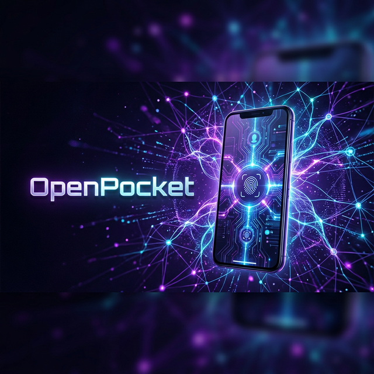

<div align="center">



# 🛰️ OpenPocket

**The absolute fastest way to turn your old Android phone into a 24/7 AI Server.**

[](https://muxd21.github.io/openpocket/)
[](#-launch)
[](LICENSE)

**OpenPocket** is a unified AI ecosystem that runs the [OpenClaw](https://openclaw.ai) engine and the [Mission Control](https://github.com/builderz-labs/mission-control) dashboard natively on Android. No virtualization bloat, no proot-distro lag. 

</div>

## 💎 The Unified Platform

OpenPocket isn't just a script; it's a pre-tuned environment where the engine and the UI are fused into one experience.

*   **⚡ Native Performance**: Runs directly on Android Bionic. 250MB footprint.
*   **🧠 Brain (OpenClaw)**: Industrial-grade agent framework.
*   **🖥️ Control (Mission Control)**: Stunning glassmorphism dashboard pre-bound to `0.0.0.0` for instant Tailscale/Network access.
*   **🛡️ Secure**: Built-in SSH server, automated wakelock, and background persistence.

## 🚀 Launch

1.  **Install [Termux (F-Droid)](https://f-droid.org/en/packages/com.termux/)**.
2.  **Paste and Run**:

```bash
curl -sL https://muxd21.me/openpocket/bootstrap.sh | bash
```

## 🛠️ Combined Setup Flow

The script automates everything in one pass:
*   **Phase 1**: Environment tuning & glibc-stub installation.
*   **Phase 2**: OpenClaw Engine & Mission Control Dashboard setup.
*   **Phase 3**: Automated path patching & hardware acceleration (Sharp).
*   **Phase 4**: 24/7 background persistence via `tmux`.

## 🛰️ Dashboard & Control

Once installed, your server is reachable globally over Tailscale:
*   **Dashboard**: `http://<your-ip>:3000`
*   **SSH**: `ssh -p 8022 <user>@<your-ip>`
*   **Console**: `openclaw tui`

---

Built for **Muxd21** by **Jarvis (RTX⚡)**. [MIT License](LICENSE).
